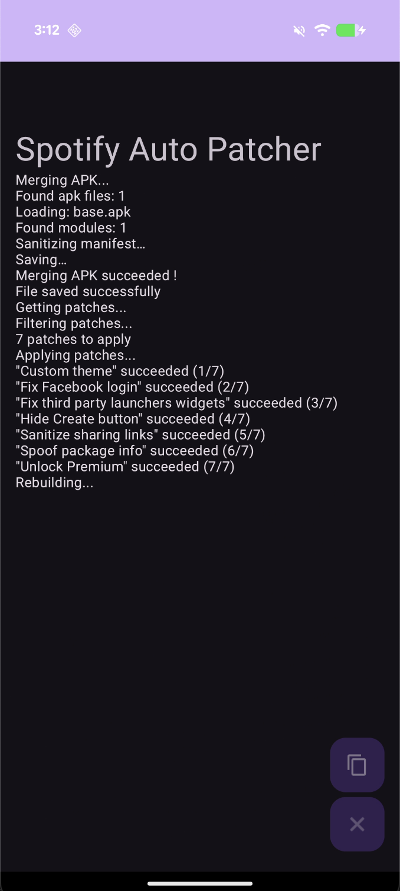

# Spotify Auto Patcher

Android app to patch Spotify and Youtube Music combining the powers of AntiSplit-M and ReVanced Manager !

## Usage

# For Spotify : 
- Uninstall your patched version of Spotify if you already have one
- Make sure you have a stable internet connection
- Install Spotify FROM THE GOOGLE PLAY STORE
- Launch Spotify Auto Patcher
- Choose Spotify
- Click on "Start"
- Wait for the processing to finish
- Click ok when asked to uninstall the existing store version of Spotify
- Click ok to install the patched version
- Make sure to disable auto updates from the Google play store
- Enjoy !

# for Youtume Music :
- Make sure you have a stable internet connection
- Install Youtube Music FROM THE GOOGLE PLAY STORE
- Launch Spotify Auto Patcher
- Choose Youtube Music
- Click on "Start"
- Wait for the processing to finish
- Click ok to install the patched version
- Make sure to disable auto updates from the Google play store
- Enjoy !

Whats it does : 
- Extract an APK from the UNPATCHED app installed FROM THE GOOGLE PLAY STORE of the phone
- Retrieve and download the latest ReVanced Patches
- Apply all existing patches
- Rebuild the APK
- Allow you to uninstall the store version before installing the patched one if needed
- Allow you to save the APK in your "Downloads" folder

But this app :
- Cannot patch anything else than Spotify or Youtube Music
- Cannot patch an already patched version of Spotify
- Cannot patch a version of Spotify installed from an APK
- Doesn't allow you to choose which patches are applied

## Used projects

⭐  forked from [AntiSplit-M](https://github.com/AbdurazaaqMohammed/AntiSplit-M) by AbdurazaaqMohammed to extract the APK
* [ReVanced Patcher](https://github.com/ReVanced/revanced-patcher) to patch the app 
* [ReVanced Patches](https://github.com/ReVanced/revanced-patches) to get the patches for Spotifysure 
* [ReVanced Library](https://github.com/ReVanced/revanced-library) to apply the patches and sign the APK

## Permissions

* QUERY_ALL_PACKAGES - to extract the APK from the installed Spotify app
* REQUEST_INSTALL_PACKAGES - to show an install button allowing prompt to install an app after merging it
* REQUEST_DELETE_PACKAGES - to show an uninstall button allowing prompt to uninstall an app after merging it
* INTERNET - to retrieve the latest revanced patches
* WRITE_EXTERNAL_STORAGE - to retrieve the latest revanced patches
